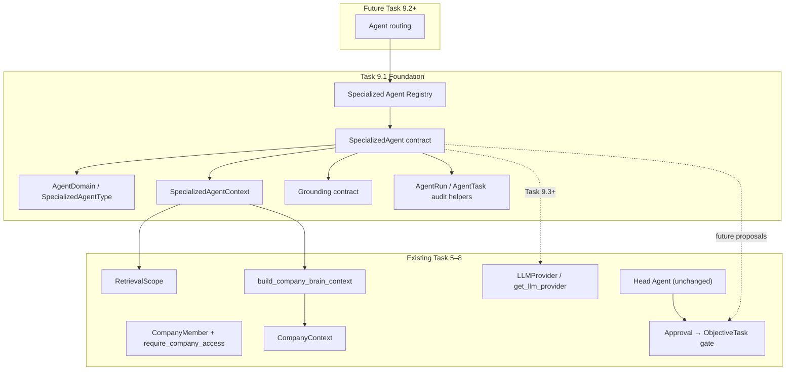

# Task 9.1 — Specialized Agent Foundation

**Date:** 2026-08-30  
**Scope:** Backend foundation for specialized reasoning agents (no routing, no LLM reasoning, no tools)

---

## Architecture

Task 9.1 establishes a provider-independent, company-scoped abstraction for future specialist agents without duplicating Brain retrieval, auth, or approval boundaries.



**Key principle:** Specialists reason over **domain-scoped Brain context** and produce **proposals**. They never mutate Company Brain truth or create ObjectiveTasks without approval.

---

## Agent contract

`SpecializedAgent` (`app/services/specialized_agents/base.py`):

| Property / method | Purpose |
|-------------------|---------|
| `agent_type` | Canonical identifier (`customer_growth`, `product`) |
| `domain` | Business domain (derived from agent type) |
| `display_name` | Founder-facing label (future UI) |
| `description` | Specialist purpose |
| `supported_intents` | Domain intent vocabulary |
| `retrieve_context(...)` | **Implemented** — uses `RetrievalScope` + `build_company_brain_context` |
| `build_prompt(...)` | **Stub** — raises `SpecializedAgentReasoningNotImplemented` |
| `recommend(...)` | **Stub** — raises `SpecializedAgentReasoningNotImplemented` |

Foundation stubs: `CustomerGrowthAgent`, `ProductAgent` in `stubs.py`.

---

## Domain contract

Centralized in `app/services/specialized_agents/domain.py`:

| Enum | Values |
|------|--------|
| `AgentDomain` | `customer_growth`, `product` |
| `SpecializedAgentType` | `customer_growth`, `product` |

Intent vocabularies:

- `CUSTOMER_GROWTH_INTENTS` — acquisition, retention, icp, customer_discovery, growth
- `PRODUCT_INTENTS` — roadmap, features, prioritization, product_discovery, ux

Parsing helpers: `parse_agent_type()`, `parse_domain()`, `domain_for_agent_type()`.

No scattered `"customer"` / `"growth"` strings in business logic.

---

## Registry

`app/services/specialized_agents/registry.py`:

```python
agent = get_specialized_agent("customer_growth")
agent = get_specialized_agent(SpecializedAgentType.PRODUCT)
```

- Built-in stubs registered on first lookup
- `UnknownSpecializedAgent` (404) for invalid types — **no silent fallback**
- `register()` for future agents (Task 9.3/9.4)

---

## Context contract

`SpecializedAgentContext` (`app/schemas/specialized_agent.py`):

Built by `build_specialized_agent_context()` from existing `CompanyContext` — **not a second Brain**.

Includes:

- `scope` (`RetrievalScope`)
- `domain`
- company, objective, constraints, facts, beliefs, decisions, evidence, learnings
- `sources` (provenance identifiers)
- `meta` (retrieval metadata)

Task 9.1 passes through full context. Task 9.3+ will apply domain filters in `build_specialized_agent_context()`.

`assert_scope_matches_membership()` ensures scope matches authorized membership.

---

## Grounding contract

`SpecializedAgentRecommendation` mirrors Head Agent proposal shape:

- title, recommendation, rationale, confidence
- `proposed_action` (reuses `ProposedAction`)
- `sources` (reuses `ContextSource`)

**Company truth vs agent proposal:** recommendations are proposals only. They do not create Facts, Beliefs, Decisions, Learnings, Objectives, or ObjectiveTasks.

`ground_specialized_recommendation()` reuses Head Agent grounding rules via shared source validation.

`parse_specialized_recommendation_payload()` validates structured output without LLM.

---

## Provider abstraction

- Specialists depend on `LLMProvider` / `get_llm_provider()` at the contract level only
- **No** `NewtronProvider` imports in `specialized_agents/`
- Task 9.1 stubs **never** call `provider_factory` or `complete()`

---

## Authorization model

1. All context retrieval requires `CompanyMember` from existing auth path
2. `RetrievalScope.from_membership(membership)` — never raw `company_id` alone
3. Scope validated against membership before context assembly
4. Tenant isolation tests prove Company A context does not appear under Company B membership

---

## Audit model

Reuses existing tables — **no new migrations**:

| Table | Specialist usage |
|-------|-------------------|
| `agent_runs` | `agent_type` = `customer_growth` / `product`, `trace_id`, provider/model fields |
| `agent_tasks` | `task_type` = `recommendation`, JSON `input`/`output` |

Helpers in `audit.py`:

- `new_specialized_agent_run()`
- `new_specialized_agent_task()`
- `SPECIALIZED_AGENT_TASK_TYPE = "recommendation"`

Same pattern as Head Agent (`head_agent` type + `recommendation` task type).

---

## Why no autonomous tools

Specialized agents in Task 9 are **reasoning agents**:

- They may propose actions (e.g. "interview 10 customers")
- They **cannot** create tasks, modify objectives, call CRM, send email, or update Brain truth

The **approval boundary** (Task 6–8) remains authoritative:

`Recommendation → Approval → ObjectiveTask → Evidence → Learning`

---

## Extension path

| Task | Adds |
|------|------|
| **9.2** | Routing — which specialist handles which question |
| **9.3** | Customer/Growth reasoning + domain-filtered retrieval |
| **9.4** | Product reasoning + domain-filtered retrieval |
| **9.5** | Head Agent synthesis across specialists (if specified) |
| **9.6** | Founder-facing specialist UI |
| **9.7–9.8** | Further integration (per spec) |

To add a new specialist:

1. Add `SpecializedAgentType` + `AgentDomain` if needed
2. Implement `SpecializedAgent` subclass with `recommend()` + `build_prompt()`
3. `register(agent)` in registry bootstrap
4. Wire routing in Task 9.2
5. Proposals flow through existing approval path

---

## Files

| Path | Role |
|------|------|
| `app/schemas/specialized_agent.py` | Pydantic contracts |
| `app/services/specialized_agents/domain.py` | Domain + agent type enums |
| `app/services/specialized_agents/errors.py` | Typed errors |
| `app/services/specialized_agents/base.py` | `SpecializedAgent` ABC |
| `app/services/specialized_agents/context.py` | Context builder |
| `app/services/specialized_agents/grounding.py` | Grounding helpers |
| `app/services/specialized_agents/audit.py` | AgentRun/AgentTask helpers |
| `app/services/specialized_agents/registry.py` | Registry |
| `app/services/specialized_agents/stubs.py` | Foundation stubs |
| `tests/test_specialized_agent_foundation.py` | Foundation tests |

**No API routes added** — foundation is internal until Task 9.2 routing.

**No database migration** — existing `agent_runs` / `agent_tasks` suffice.

**No frontend changes.**
