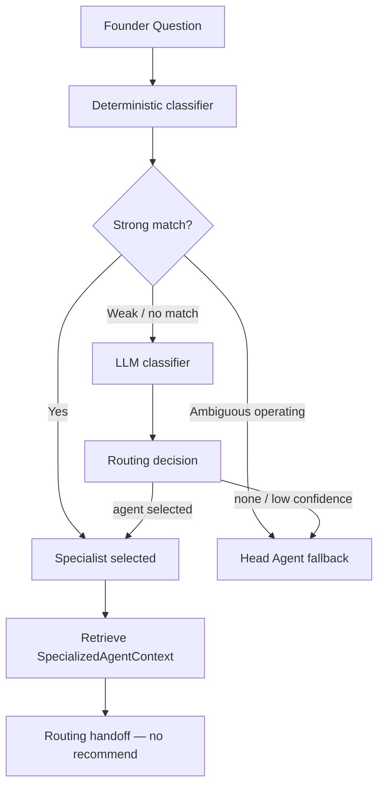

# Task 9.2 — Specialized Agent Router

**Date:** 2026-08-30  
**Scope:** Routing layer only — no specialist reasoning, no API, no UI

---

## Routing architecture

Entry point: `route_specialized_agent()` in `app/services/specialized_agents/routing/router.py`.

---

## Deterministic routing

`classify_deterministic()` in `deterministic.py`:

- Keyword scoring per `RoutingIntent` (centralized in `routing/intents.py`)
- Strong match requires term length ≥ 10 **or** ≥ 2 hits in one domain
- No LLM, no Brain retrieval
- Typical latency: &lt; 5 ms (100 iterations &lt; 500 ms in tests)

---

## LLM fallback

Used when deterministic status is `weak_match` or `no_match`.

- `classify_with_llm()` via `get_llm_provider()` — never `NewtronProvider` directly
- Structured JSON validated into `LlmRoutingClassification`
- Invalid JSON/schema → `InvalidClassification` (502)
- **One** LLM call maximum per route

---

## Supported intents

| Domain | Intents |
|--------|---------|
| Customer/Growth | `customer_acquisition`, `customer_retention`, `customer_discovery`, `customer_interviews`, `pricing_demand`, `growth`, `marketing` |
| Product | `product_roadmap`, `product_features`, `product_prioritization`, `product_quality`, `product_strategy`, `ux` |
| Fallback | `general` |

---

## Confidence model

Uses `low` / `medium` / `high` (same as Head Agent recommendation confidence).

- Deterministic strong matches → **high**
- LLM **low** confidence → Head Agent fallback (no specialist route)
- Intent/agent_type mismatch after LLM → fallback with **low**

---

## Ambiguous questions

Examples: “What should we do next?”, “What should I focus on?”

**Behavior:** deterministic `AMBIGUOUS` status → `fallback_to_head_agent=True`, `selected_agent=None`, confidence **low**, routing_method **fallback**, **no LLM call**.

Consistent with Head Agent handling broad operating questions (Task 6 `OPERATING` intent).

---

## Tenant isolation

- Routing receives `CompanyMember` from existing auth path
- Context handoff uses `RetrievalScope.from_membership(membership)`
- `assert_scope_matches_membership()` validates scope after retrieval
- Cross-company tests prove Company A context ≠ Company B

Authorization never derived from LLM output or question text.

---

## Context handoff

`SpecializedRoutingHandoff`:

- `decision`: `SpecializedRoutingDecision`
- `context`: `SpecializedAgentContext | None` (only when specialist selected)

Context retrieved via specialist `retrieve_context()` — **not** `recommend()`.

---

## Fallback to Head Agent

When `fallback_to_head_agent=True`:

- `selected_agent=None`, `domain=None`, `intent=general`
- Head Agent continues to handle general operating synthesis (unchanged in 9.2)

No third fake specialist introduced.

---

## Performance

| Path | LLM | Brain retrieval |
|------|-----|-----------------|
| Strong deterministic | No | Only if context handoff requested |
| Ambiguous fallback | No | No |
| LLM fallback | Yes (1 call) | Only if specialist selected + context requested |

No vector retrieval for classification. `specialized_routing_perf` INFO logs record timing.

---

## Audit

**No `AgentRun` rows** created for routing in Task 9.2 — avoids polluting execution history for cheap classification.

Specialist execution audit remains on `AgentRun`/`AgentTask` when reasoning is implemented (Task 9.3+).

---

## Domain-scoped retrieval (extension)

`DOMAIN_RETRIEVAL_SECTIONS` in `domain_retrieval.py` documents future filtering.

Task 9.3/9.4 will filter in `build_specialized_agent_context()` — not duplicated here.

---

## Extension path

| Task | Adds |
|------|------|
| 9.3 | Customer/Growth `recommend()` + domain retrieval filter |
| 9.4 | Product `recommend()` + domain retrieval filter |
| 9.6 | Founder-facing specialist UI |
| Future | Engineering, Finance, Marketing — register agent + add routing intents |

---

## Files

| Path | Role |
|------|------|
| `app/schemas/specialized_routing_types.py` | `RoutingIntent`, domain maps |
| `app/schemas/specialized_routing.py` | Decision/handoff contracts |
| `app/services/specialized_agents/routing/deterministic.py` | Keyword router |
| `app/services/specialized_agents/routing/llm_classifier.py` | LLM fallback |
| `app/services/specialized_agents/routing/router.py` | Orchestration |
| `app/services/specialized_agents/routing/intents.py` | Term patterns |
| `app/services/specialized_agents/routing/domain_retrieval.py` | Future filter docs |
| `tests/test_specialized_agent_router.py` | 23 routing tests |

**No API routes. No database migration. No frontend changes.**
