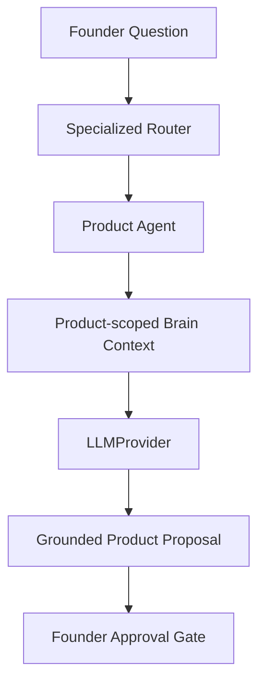

# Task 9.4 — Product Specialist Agent

**Date:** 2026-08-30  
**Scope:** Second real specialized reasoning agent (product domain only)

---

## 1. Purpose

The Product Agent reasons about product strategy, roadmap, feature prioritization, UX, quality, discovery, and validation using **domain-scoped Company Brain context**. It produces **grounded proposals only** — never mutates Brain truth or creates tasks without approval.

---

## 2. Product responsibilities

- Feature prioritization from evidence
- Roadmap questions (existing decisions vs proposals)
- UX and quality tradeoffs
- Product discovery and validation guidance
- Honest handling of missing metrics

---

## 3. Supported intents

From `RoutingIntent` (product domain):

- `product_roadmap`
- `product_features`
- `product_prioritization`
- `product_quality`
- `product_strategy`
- `ux`

---

## 4. Context architecture

Built via `build_company_brain_context()` then `build_specialized_agent_context()` with `filter_company_context_for_domain(PRODUCT)`:

| Section | Included |
|---------|----------|
| Company | Always |
| Current objective | Always |
| Constraints | All active |
| Facts | Product keyword match |
| Beliefs | Product keyword match |
| Decisions | Product keyword match |
| Evidence | Product keyword match (includes cross-domain UX/onboarding evidence) |
| Learnings | Active + keyword match |

---

## 5. Domain filtering

`domain_filter.py` — keyword heuristics for product signals (feature, roadmap, UX, onboarding, quality, etc.). Cross-domain evidence retained when product-relevant (e.g. customer interviews about confusing onboarding).

Customer/Growth filtering unchanged.

---

## 6. Reasoning flow

`ProductAgent.recommend()`:

1. Create `AgentRun`
2. One `retrieve_context()` pass
3. Build prompt via `product_prompt.py`
4. One `LLMProvider.complete()` call
5. Parse JSON → `SpecializedAgentRecommendation`
6. `ground_specialized_recommendation()`
7. Persist `AgentTask`
8. Return `SpecializedAgentRecommendResponse`

---

## 7. Product prioritization

Reasons from objective alignment, evidence strength, constraints — without inventing numerical scores. Uses qualitative comparison when metrics are absent.

---

## 8. Grounding

Reuses Task 9.1 `ground_specialized_recommendation()`:

- Valid source IDs retained
- Invalid IDs rejected
- No sources → confidence forced to `low`

---

## 9. Confidence

`low` / `medium` / `high` after grounding. Sparse evidence → conservative confidence.

---

## 10. Prompt injection defense

Delimiters: `FOUNDER_QUESTION_START/END`, `CURRENT_OBJECTIVE_START/END`, `BRAIN_CONTEXT_START/END`. Brain and founder text treated as DATA only.

---

## 11. Provider abstraction

`get_llm_provider()` only. No `NewtronProvider` imports. Injectable `provider_factory` for tests. Structured JSON + Pydantic validation.

---

## 12. Audit

One `AgentRun` + one `AgentTask` per recommendation. Fields: company_id, agent_type=`product`, objective_id, provider, model, trace_id, status, timestamps.

---

## 13. Tenant isolation

`RetrievalScope` + membership verification. Cross-company tests enforce isolation.

---

## 14. No-mutation boundary

Does not modify Objective, ObjectiveTask, Fact, Belief, Decision, Evidence, Learning, or Approval. Proposals only.

---

## 15. Router integration

- `get_specialized_agent("product")` returns `ProductAgent`
- `recommend_routed_specialist()` routes product questions to Product Agent
- Customer/growth and Head Agent fallback unchanged

---

## 16. Performance

Per recommendation: 1 retrieval, 1 LLM call, 1 parse/ground, 1 persistence. Instrumented via `product_agent_perf` log.

---

## 17. Extension path

Task 9.5 Head Agent synthesis, Task 9.6 UI, Task 9.7 tools — not in scope.

---

## Examples

**Feature prioritization:** "Which feature should we prioritize next?" → Product Agent, grounded recommendation citing UX evidence.

**Missing metrics:** "Which feature generates the most revenue?" with no data → honest insufficient-evidence response, no invented numbers.

**Roadmap:** With no roadmap decisions → explicit insufficient information, optional validation proposal.
