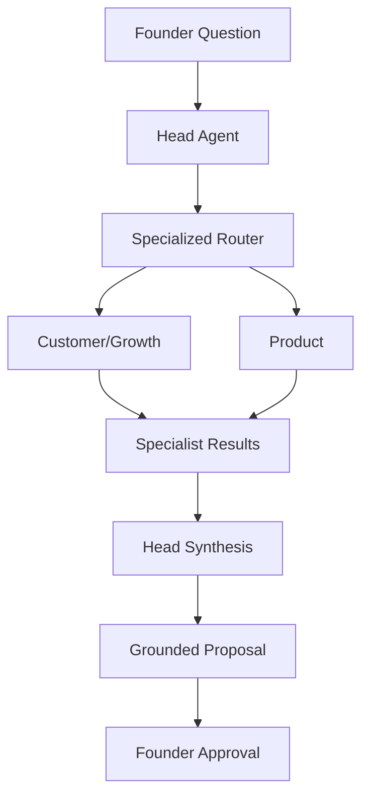

# Task 9.5 — Head Agent Specialist Orchestration & Synthesis

**Date:** 2026-08-30  
**Scope:** Head Agent orchestrates specialists and synthesizes grounded proposals

---

## Architecture

**Layer distinction:** Brain truth ≠ specialist analysis ≠ Head proposal ≠ founder-approved decision.

---

## Head Agent role

Orchestrator and synthesizer. Does not mutate company state. Produces proposals compatible with Task 6 approval flow.

---

## Specialist role

Domain experts (Customer/Growth, Product). Produce validated `SpecializedAgentRecommendation` — analysis, not company truth.

---

## Router role

Task 9.2 `classify_deterministic` + optional LLM classifier via `resolve_orchestration_plan()`:

| Plan | Behavior |
|------|----------|
| `head_only` | Ambiguous operating questions |
| `single_specialist` | Strong single-domain match |
| `multi_specialist` | Strong both-domain match (max 2) |

---

## Synthesis flow

1. Retrieve Company Brain context (once for Head path)
2. Plan orchestration (deterministic first)
3. Invoke specialist(s) if planned
4. Head synthesis LLM with Brain + `SPECIALIST_OUTPUT` delimiters
5. Ground sources against Brain context
6. Persist Head `AgentRun` / `AgentTask` with `specialist_agents` metadata

---

## LLM call budget

| Scenario | LLM calls |
|----------|-----------|
| Broad / ambiguous | 1 (Head direct) |
| Single specialist (deterministic) | 2 (specialist + synthesis) |
| Mixed domain | 3 (2 specialists + synthesis) |

No recursive agent calls. Routing LLM only when deterministic is weak/no match.

---

## Conflict handling

Synthesis prompt requires honest conflict representation when specialists disagree. No fabricated winners.

---

## Grounding

Final sources validated via `recommendation_grounding.ground_recommendation_sources()`. Specialist recommendations are not Brain sources.

---

## Audit

- Head Agent `AgentRun` + `AgentTask` per recommendation
- Specialist runs use shared `trace_id` when orchestrated
- No parent/child run FK — documented limitation

---

## Failure handling

- Specialist failure → Head-only fallback (single specialist)
- Multi-specialist partial failure → continue with successful specialists
- Synthesis failure → safe error, no mutations

---

## Extension path

Task 9.6 UI, 9.7 tools, 9.8 autonomy — not in scope.
